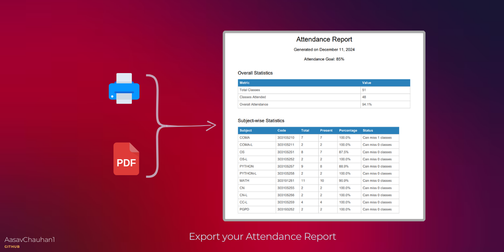

# 🚀 College Attendance Tracker App

Welcome to the **College Attendance Tracker App** repository! 🎉 This app is designed to simplify attendance management, helping students hit their attendance goals while allowing them to plan for well-deserved breaks. Say goodbye to manual tracking and hello to effortless organization!

---

## 🔑 Key Features

- ✅ **Easy Attendance Tracking**: Seamlessly log classes attended and conducted.
- 📊 **Real-Time Calculations**: Instantly view your attendance stats.
- 🏖️ **Bunk Planner**: Know how many lectures you can skip while staying on track.
- 📜 **Detailed Receipts**: Generate, save, and print your attendance reports.
- ⚠️ **Smart Alerts**: Get real-time prompts for invalid inputs or milestones.
- 📱 **Mobile-Friendly Design**: Enjoy a smooth experience on any device.

---

## 🖼️ Screenshots

  
_A sleek and intuitive interface to make tracking attendance a breeze._

  
_A detailed summary of your attendance stats, perfect for printing or saving._

---

## 🚀 Quick Start Guide

### Prerequisites

- A modern web browser (e.g., Chrome, Firefox, Edge).

### Steps to Use

1. Clone the repository:
   ```bash
   git clone https://github.com/AasavChauhan1/College-Attendance-Tracker-App.git
   ```

2. Navigate to the project folder:
   ```bash
   cd College-Attendance-Tracker-App
   ```

3. Launch the app by running the command in active current directory.
     ```bash
   npm run dev
   ```

---

## 🛠️ How It Works

1. **Input Your Data**:
   - Enter the total number of lectures conducted and attended.
2. **Set Attendance Goals**:
   - Define your desired minimum attendance percentage.
3. **Analyze Results**:
   - View your current attendance percentage.
   - Check the minimum lectures needed to meet your goals.
   - Discover how many lectures you can skip safely.
4. **Generate Receipts**:
   - Save or print attendance reports for your records.

---

## 🧰 Built With

- **HTML**: For the app's structural design.
- **CSS**: To style a visually appealing interface.
- **JavaScript**: To make the app interactive and functional.

---

## 🤝 Contributing

We’d love your contributions! Here’s how you can get involved:

1. **Fork the Repository**: Create your personal copy of the project.
2. **Create a New Branch**:
   ```bash
   git checkout -b your-feature-name
   ```
3. **Make Changes**: Enhance the app with your ideas.
4. **Commit Changes**:
   ```bash
   git commit -m "Added a cool new feature"
   ```
5. **Push to GitHub**:
   ```bash
   git push origin your-feature-name
   ```
6. **Open a Pull Request**: Submit your work for review.

---

## 📜 License

This project is licensed under the [MIT License](LICENSE). Feel free to use and modify it as per your needs.

---

## 📬 Stay Connected

Have questions or suggestions? Reach out!

**Aasav Chauhan**  
- 🌐 [GitHub](https://github.com/AasavChauhan1)  
- ✉️ Email: [aasavchauhan@gmailcom](aasavchauhan@gmail.com)  

---

Thank you for using the **College Attendance Tracker App**! 🎓 We hope it makes managing your attendance a whole lot easier and more fun!
